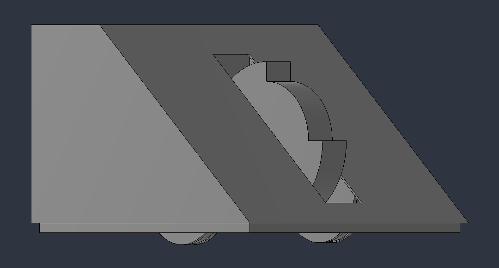
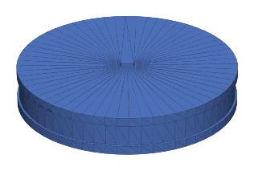

# Robot sumo et suiveur de ligne

Projet de **Sciences de l'ingénieur (SI)** au lycée, réalisé en équipe de trois :
un robot sur **Arduino Uno** capable de suivre une ligne et de combattre en **sumo robotique**
(repérer l'adversaire et le pousser hors du cercle).

J'étais **chef de projet** : répartition et suivi des tâches dans l'équipe, et conception mécanique
sous **SolidWorks** (châssis, coque, roues), avec des pièces fabriquées en **impression 3D**.

<p align="center">
  
</p>

<p align="center">
  
</p>

> Les fichiers `.stl` s'affichent en 3D directement sur GitHub : cliquez dessus pour les faire tourner.

## Contenu

```
cao/
  solidworks/        pièces et assemblage SolidWorks de la version finale (Terminale, 2023)
  stl/               pièces exportées pour l'impression 3D
premiere_version/    première version du robot (2022) : châssis, boîtes moteurs, toit, roues
code/
  capteur_ultrason/  programme Arduino du capteur à ultrasons HC-SR04
images/              captures et aperçus des pièces
```

### Version finale (2023) — `cao/solidworks/`

| Fichier | Pièce |
|---|---|
| `Assemblage1.SLDASM` | Assemblage du robot |
| `ROBOT COQUE V6.SLDPRT` | Coque (version 6) |
| `devant 1 sans encoches.SLDPRT` | Face avant |
| `ARRIERE 1 .SLDPRT` / `ARRIERE 1 SANS encoches.SLDPRT` | Face arrière, avec ou sans encoches |
| `cotes 1  encoches.SLDPRT` / `cotes 1 sans encoches.SLDPRT` | Côtés, avec ou sans encoches |
| `dessus 1 sans encoches.SLDPRT` | Dessus |
| `roues motrices v finale.SLDPRT` | Roues motrices (version finale) |
| `roue milieu.SLDPRT`, `2ROULETTES.SLDPRT` | Roue centrale et roulettes |
| `robot.SLDPRT`, `robot2.SLDPRT` | Versions de travail du corps du robot |

Les noms des fichiers SolidWorks sont conservés tels quels, car l'assemblage les référence.

### Première version (2022) — `premiere_version/`

Châssis, boîtes de moteurs, toit et roue imprimée en 3D (fichiers SolidWorks, STL et 3MF).

## Électronique et code

- Carte **Arduino Uno** et moteurs à courant continu.
- **Capteurs de ligne** pour rester dans l'arène et suivre une ligne.
- **Capteur à ultrasons HC-SR04** pour détecter l'adversaire : le programme de test de ce capteur
  est dans [`code/capteur_ultrason/`](code/capteur_ultrason/capteur_ultrason.ino). Il envoie une
  impulsion de 10 µs sur la broche TRIG, mesure la durée de l'écho et la convertit en distance (vitesse du son 340 m/s).

## Ce que ce projet m'a appris

- Mener un projet en équipe : découper le travail, répartir les tâches, tenir un planning.
- Concevoir des pièces sous SolidWorks en pensant à leur fabrication par impression 3D,
  avec plusieurs itérations (coque V6, roues jusqu'à la version finale).
- Faire dialoguer capteurs, moteurs et microcontrôleur sur un vrai robot.

## Licence

**Tous droits réservés.** Ce dépôt est publié uniquement pour être consulté. Voir [LICENSE](LICENSE).

## Auteur

**Antoine Pelissier** — étudiant ingénieur en robotique autonome, Polytech Nice Sophia
[Portfolio](https://tonio1547.github.io) · [LinkedIn](https://www.linkedin.com/in/antoine-pelissier1)
